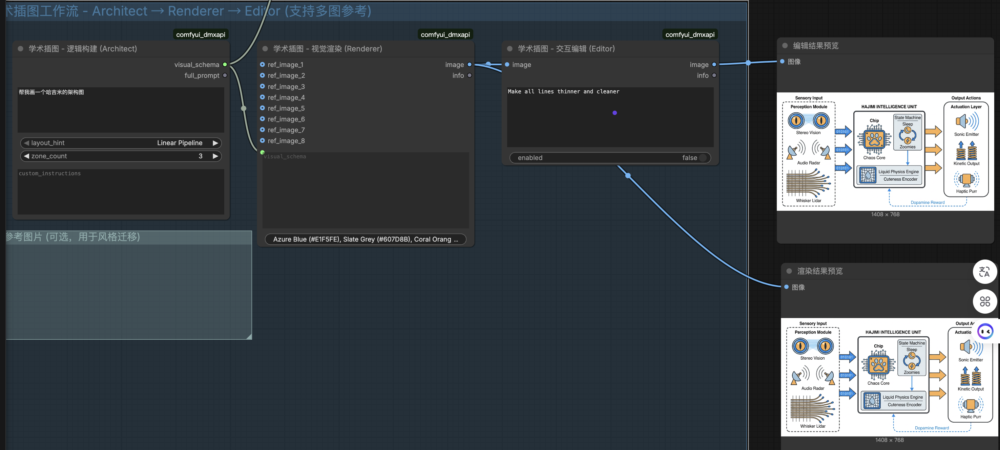
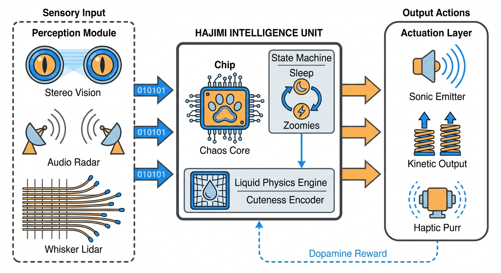
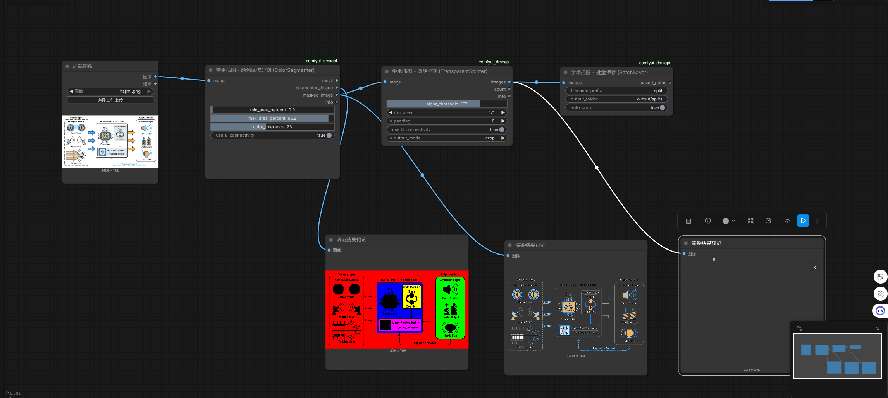
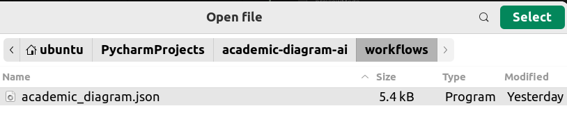

# 学术插图 AI 绘制工作流

> 欢迎发起 issue，补充需要的绘图功能！

基于 ComfyUI 的学术插图生成工具，通过 LLM 理解需求并自动生成专业的学术风格图表。

**Demo: 生成科研style的哈吉米介绍图片：**

<table>
  <tr>
    <td></td>
    <td></td>
  </tr>
</table>

**Demo: 将生成的图片拆解为单独的图标 Icon**

<table>
  <tr>
    <td></td>
    <td></td>
    <td></td>
  </tr>
</table>


## 环境配置

```bash
# 1. 安装依赖
bash setup.sh

# 2. 启动 ComfyUI
bash start.sh
```

首次运行前，请编辑 `config_llm.json` 填入你的 API Key 和 Base URL。

## 访问

http://localhost:8188

`Ctrl + O` 打开加载 workflow 的界面


选择 `workflows/academic_diagram.json`



然后就可以看到该工作流：


## 工作流概览

```
┌─────────────────┐    ┌─────────────────┐    ┌─────────────────┐
│  Step 1         │    │  Step 2         │    │  Step 3         │
│  The Architect  │ -> │  The Renderer   │ -> │  The Editor     │
│  逻辑构建         │    │  视觉渲染        │    │  交互式微调       │
│  (Gemini/GPT)   │    │  (Nano-Banana)  │    │  (自然语言编辑)   │
└─────────────────┘    └─────────────────┘    └─────────────────┘
         │
         v
┌─────────────────┐    ┌─────────────────┐    ┌─────────────────┐
│  Step 4         │    │  Step 5         │    │  Step 6         │
│  ColorSegmenter │ -> │TransparentSplit │ -> │  BatchSaver     │
│  颜色区域分割     │    │  透明分割        │    │  批量保存        │
│  (洪水填充)      │    │  (连通区域)      │    │  (PNG+Alpha)    │
└─────────────────┘    └─────────────────┘    └─────────────────┘
```

## 自定义节点

节点代码位于 `ComfyUI/custom_nodes/comfyui_dmxapi/`：

### 核心生成节点

| 节点 | 功能 |
|------|------|
| **AcademicArchitect** | 将论文内容（摘要/方法章节）转化为结构化的 Visual Schema |
| **AcademicRenderer** | 根据 Schema 调用图像模型生成学术风格插图，支持参考图输入 |
| **AcademicEditor** | 对生成的图像进行自然语言编辑微调 |

### 图像分割节点

| 节点 | 功能 |
|------|------|
| **ColorRegionSegmenter** | 基于洪水填充的颜色区域分割，输出 mask 和透明图像 |
| **TransparentSplitter** | 基于透明度将 PNG 分割为独立元件 |
| **BatchImageSaver** | 批量保存图像为 PNG（支持透明通道，自动裁剪边界） |

## 常见疑问

**Q: 我在网页端修改了 workflow 会自动保存吗？**

A: 需要Ctrl + S, 会保存到 `./ComfyUI/user` 中

**Q: 生成的图片会自动保存到本地吗?**

A: 会的. 会保存到 `./ComfuUI/temp` 中

**Q: 为什么运行后是红色的结果**

A: 这是报错的意思.可能原因包括但不限于:

- API key不正确, 或者该API Key没有访问特定模型的权限
- API Base写错了, 可以把多种后缀的都试试, 比如 /v1,  /v1/chat/completions/的
- 其他报错, 可以在issue提


